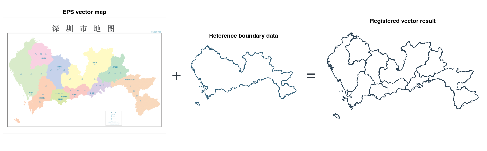
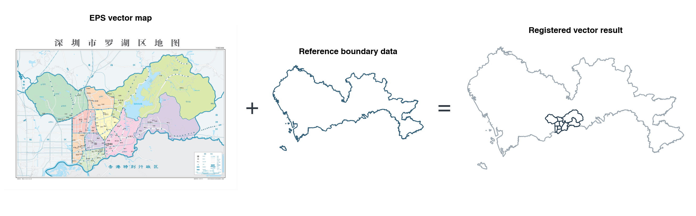

<div align="center">

<h2>🗺️ EPS/PDF 行政区划边界配准</h2>

**把没有地理坐标的行政区划矢量 EPS/PDF 图，转换成可复核的 GIS 边界**

[](https://www.python.org/)
[](#-适用范围)
[](#-输出与质量检查)
[](#️-准确性与使用限制)

*支持矢量 EPS 和 PDF；现有案例以天地图 EPS 为主。*

[🚀 快速开始](#-快速开始) · [🖼️ 案例预览](#️-案例预览) · [🛡️ 准确性与使用限制](#️-准确性与使用限制) · [English](README.en.md)

</div>

---

> [!CAUTION]
> **仅用于科研制图和探索性分析。** 结果有误差，不是法定界线、标准地图或测绘成果。参考数据即使准确，也只能帮助定位整张图，不能证明图中的每条区界都准确。使用前请查看检查报告 `qc.json` 和叠加图 `overlay.png`，并遵守数据许可。

> [!IMPORTANT]
> **先确认图画的是哪里。** 需要一张无地理坐标的矢量 EPS/PDF，以及覆盖相同目标区域、坐标系正确的 SHP/GPKG 参考边界。程序会先核对图面范围，再检查配准后的吻合程度。仅凭文件名、城市名或两份文件的原始坐标范围，不能认定它们匹配；证据不足会暂停，不输出最终成果。

> [!WARNING]
> **留意成果的含义。** 只有本次提交的城市及合并检查全部通过、但尚未覆盖参考数据中的所有城市时，才会生成 `batch_preview.gpkg`；它只含本次提交的城市。行政区面即使已定位成功，图上看不清的区名仍会留空。选择“贴合参考外轮廓”（Mode C）时，补出的面积来自参考数据，并非原图画出的内容。

## ✨ 项目做什么

本项目把**没有地理坐标的行政区划矢量 EPS/PDF 图**放到真实地图位置上，并导出可在 QGIS 等软件中打开的 GeoPackage（`.gpkg`）。天地图 EPS 是主要案例；多页矢量 PDF 可以选页。照片、扫描件和只有图片的 PDF 不适用。

单图处理需要**一张待配准图**和**一份已经知道地理位置的参考边界**。程序先提取图上的行政区，再比较两份边界并计算位置；找不到可靠对应关系时会暂停。

### 功能特点

- **提取边界**：读取图中的填色面或线条；有宽度的色带不会直接当作行政区。
- **核对并定位**：先核实图面与参考范围，再拟合边界，并检查是否存在多个看似正确的位置。
- **保留证据**：名称只依据图面文字或人工核对；不确定就留空并提供局部图片供检查。
- **按需批量**：用户明确要求合并多个城市时，逐城处理，再检查合并结果。
- **暂停机制**：范围、提取或拟合证据不足时，给出复核材料，不生成最终 GPKG。

## 📐 两种成果有什么区别？

| 方式 | 做了什么 | 何时使用 | 文件 |
|---|---|---|---|
| **保留原图边界（Mode R，默认）** | 对整张图做同一次空间变换，把它放到参考位置；保留图上画出的内部区界和外轮廓。因此外轮廓可能与参考边界有差异。 | 通常先用它检查原图；两份数据只共享一段边界时也只用它。 | `registered.gpkg` |
| **贴合参考外轮廓（Mode C）** | 先得到 Mode R，再按参考数据修整外轮廓；原图未画出的边缘面积可能被补入某个行政区。 | **仅当两份数据确实覆盖同一范围，而且需要外轮廓吻合**时使用。补入面积归属不明确则暂停。 | 同时保留 `registered.gpkg` 和 `conformed.gpkg` |

Mode C 的“贴合”不代表内部区界更准确；补出的部分来自参考边界，必须在检查报告中说明。单图默认 Mode R；批量合并会逐城检查 Mode C，同时保留 Mode R 供对照。

## 🎯 适用范围

| 输入 | 支持情况 |
|---|---|
| 天地图等来源的无坐标行政区划 EPS | **主要使用场景** |
| 含真实线条或填色面的矢量 PDF 行政区划图 | 可直接读取；多页文件默认第 1 页，也可指定页码 |
| 扫描件、栅格地图、SVG、DXF 或一般绘图文件 | 不属于当前入口支持范围 |

如果输入本身已有可靠地理坐标系，直接在 GIS 软件中重投影，无需使用本项目。

## 🗂️ 配准必须准备两类数据

请准备两份**用途不同**的文件：

| 数据 | 必需文件 | 要求 |
|---|---|---|
| 待配准地图 | 行政区划矢量 `.eps` 或 `.pdf` | 含要提取的填色面或线条；没有真实地理坐标 |
| 参考边界 | 与图面目标区域相符、位置已知的 `.shp` 或 `.gpkg` | 已写入**正确的坐标系（CRS）**。Shapefile 的 `.shp/.shx/.dbf/.prj` 文件要放在一起；GeoPackage 可包含多个图层，需选对图层 |

配置中的 `source_map` 指待配准图，`reference_boundary` 指参考边界。参考 GPKG 有多个图层时填写 `reference_layer`；同一图层含多个城市时再用 `reference.filter` 选出目标城市。程序最终使用参考数据的坐标系，但不会把这个坐标系直接贴到 EPS/PDF 的页面坐标上。

**范围必须能对应上。** 最容易处理的是：原图和参考都表示同一个完整地区，例如两者都是深圳市全域；这不要求它们的线条在配准前已经重合。若原图只画参考区域的一部分，当前程序需要一段经过核实的共同外边界，以及两个能同时在原图和真实地图上确定位置的点。只有“都在深圳”还不够。程序会给出图面与参考的对照图；原图没有地理坐标，不能直接比较两份文件的数字坐标范围。

**边界不能只看形状相似。** 对于有宽度的色带，优先取行政填色面的边缘；仅当色带朝向行政区的内缘唯一可判定时才考虑内缘。小岛归属、区名或配准位置不明确时暂停复核。拟合后还会检查整张图是否贴合参考，未通过就不交付最终 GPKG。

## 🚀 快速开始

> 以下是 Windows PowerShell 命令。安装 Skill 需要 Node.js/npm；运行脚本需要 **Python 3.11**。**只处理原生矢量 PDF 时，可跳过第 3 步的 Ghostscript。**

### 1. 用 npx 安装到 Codex

```powershell
npx skills@latest add zhuangcg/tianditu-eps-boundary-registration --skill tianditu-eps-boundary-registration --agent codex --global --copy --yes
```

这是 Agent Skills 的 GitHub 安装方式，会把 Skill 与所需脚本放到 Codex 的用户级目录；不需要手动克隆仓库。安装完成后重新打开 Codex 会话。`npx` 会按需运行 [skills CLI](https://www.npmjs.com/package/skills)。

### 2. 安装 Python 运行依赖

在你存放输入数据和输出结果的工作目录创建独立环境。依赖清单直接从 GitHub 读取，无需下载或克隆整个仓库：

```powershell
py -3.11 -m venv .venv
.\.venv\Scripts\python.exe -m pip install --upgrade pip
.\.venv\Scripts\python.exe -m pip install -r https://raw.githubusercontent.com/zhuangcg/tianditu-eps-boundary-registration/main/requirements.txt
```

macOS/Linux 使用 `python3.11 -m venv .venv`，并将 `.venv\Scripts\python.exe` 换为 `./.venv/bin/python`。若只想手动运行源码，也可从 GitHub 下载仓库后按 `requirements.txt` 安装；这是可选方式。

### 3. 使用 EPS 时安装 Ghostscript；原生矢量 PDF 可跳过

程序先用 Ghostscript 把 EPS 转为**仍保留线条和填色面的矢量 PDF**，再读取。若输入本来就是矢量 PDF，程序直接读取，不经过 Ghostscript。从 [Ghostscript 官方下载页](https://ghostscript.com/releases/)安装后，可用以下命令检查：

```powershell
gswin64c -version
```

扫描 PDF 虽然也是 `.pdf`，但只有像素，没有本流程需要的矢量边界，仍不能处理。若图中文字已转成图形、需要自动文字识别（OCR），可额外安装 OCR；OCR 与 Ghostscript 是两件事：

```powershell
.\.venv\Scripts\python.exe -m pip install rapidocr-onnxruntime==1.4.4
```

### 4. 创建案例配置

以下命令按 Codex 默认用户目录设置 Skill 路径；若安装时使用了自定义 `CODEX_HOME`，请按安装位置调整。

```powershell
New-Item -ItemType Directory -Force runs | Out-Null
$skillRoot = Join-Path $HOME ".codex\skills\tianditu-eps-boundary-registration"
Copy-Item "$skillRoot\templates\config.example.yaml" runs/my-case.yaml
```

编辑 `runs/my-case.yaml`，至少填写：

```yaml
source_map: "D:/maps/shenzhen-districts.eps"
reference_boundary: "D:/gis/shenzhen-boundary.gpkg"
reference_layer: null # GPKG 有多个空间图层时填写实际图层名
admin_level: district
source_scope: same_extent
user_intent: "提取深圳市区级边界；图面与深圳市参考边界同范围"
output_dir: "runs/my-case/output"
work_dir: "runs/my-case/work"
```

以上路径仅是格式示例，请换成自己的文件。几个容易填错的选项：

| 配置项 | 通俗解释 |
|---|---|
| `admin_level: district` | 要提取的是区级行政面；街道图应改为 `street`。 |
| `source_scope: same_extent` | 原图与参考表示同一个完整地区。若只共享一段经核实的外边界，用 `shared_boundary`；这时还需两个可信定位点。没有共同边界时，本流程会停止。 |
| `user_intent` | 用户真正要求提取什么、图面与参考是什么关系；不要照抄示例中的“深圳”。 |
| `source_page: 2` | 可选；矢量 PDF 取第 2 页，页码从 1 开始。EPS 只能取第 1 页。 |
| `scope_confirmation` | 可选；仅记录用户已经明确说过的范围关系。保留原话，并写明它是“同范围”还是“共享外边界”；不要根据文件名替用户确认。 |

如果参考 GPKG 的同一图层含多个城市，还需用 `reference.filter` 指定目标城市，字段格式见[配置模板](templates/config.example.yaml)。图上若有街道文字，但目标是区级填色面，应先查看图面；确有证据时可在 `scope_review.admin_level_conflict` 写明判断，它不能代替用户的范围确认。

### 5. 检查输入并运行

```powershell
$skillRoot = Join-Path $HOME ".codex\skills\tianditu-eps-boundary-registration"
& ".\.venv\Scripts\python.exe" "$skillRoot\scripts\inspect_environment.py" --config runs/my-case.yaml
& ".\.venv\Scripts\python.exe" "$skillRoot\scripts\run.py" --config runs/my-case.yaml
# 仅在 run.py 返回交付成功后执行：
& ".\.venv\Scripts\python.exe" "$skillRoot\scripts\check_output_manifest.py" runs/my-case/output --config runs/my-case.yaml
```

`run.py` 显示成功交付后，才执行最后一行检查文件是否齐全。若它显示需要复核，先打开运行目录中的 `work/review.json` 和相应预览图；不要把“暂停”当作运行成功。命令行 `--intent` 只用于单图，并应写用户的真实要求。

## 🧭 Agent 调用与复核约定

给 Agent 的顺序是：**选单图或批量 → 看原图和参考 → 运行 → 按结果处理**。单图用 `config.example.yaml`；只有用户要求合并多个城市时才用 `batch.example.yaml`。若用户已经确认范围，记录该答复即可；若证据冲突，不能靠改文件名、降低检查标准来“通过”。

| 程序状态 | 意思与下一步 |
|---|---|
| `REVIEW_SCOPE` / `NO_COMMON_BOUNDARY` | 原图与参考的关系不清，或明确没有共同边界。看对照图；必要时请用户确认范围或提供更合适的参考。 |
| `REVIEW_EXTRACTION` | 不确定哪些填色或线条是行政区，或小岛、色带的内侧不明确。看局部预览后再选。 |
| `REVIEW_NAMES` | 要求名称完整，但部分名称缺乏图面证据。看文字裁片，不要凭常识补名。 |
| `REVIEW_REGISTRATION` | 拟合后吻合不足，或有多个可信位置。核对叠加图与参考；不能因城市名正确就忽略此状态。 |
| `REVIEW_CONFORMANCE` | Mode C 无法确定补出的边缘面积属于哪个行政区。停止贴合，核查原图。 |
| `REGISTERED_REVIEW_NAMES` | 边界文件已生成，但部分行政区面的名称字段仍空白；交付时要明确说出。默认名称模式也可能允许空名，并在 `qc.json` 记录。 |

> [!NOTE]
> **数字门槛只是决定能否自动交付，不是精度承诺。** 对同范围图，程序会检查重叠程度（IoU，越接近 1 越好）、两边界之间的距离（P90，表示约九成采样点的误差不超过该值）及配准位置是否唯一。当前门槛是 IoU ≥ 0.95、两个方向的 P90 均不超过参考区域面积等效半径的 1%。未过门槛就进入复核；过了仍须查看叠加图和内部区界。

## 🖼️ 案例预览

| 深圳区级行政区 EPS | 罗湖街道级行政区 EPS |
|:---:|:---:|
|  |  |
| 原图与参考都覆盖深圳市；提取 10 个区。外轮廓采样点到参考边界的距离中位数为 12.75 m、P90 为 72.99 m。没有同级区界参考，内部区界仍待独立验证。 | 只使用了约 13.76 km 的已核实共同边界来定位；距离中位数为 10.90 m、P90 为 23.63 m。原图约 73.34% 的外轮廓采样点没有参与定位。 |

以上数值仅描述对应案例和数据版本，不是其他地图的精度承诺或通过阈值。原 EPS 和参考数据未随仓库发布；复现案例需要自行准备有使用授权的数据。

## 📦 输出与质量检查

| 文件 | 内容 |
|---|---|
| `registered.gpkg` | 默认 Mode R 成果：定位后的行政区面、图上外轮廓和参考边界 |
| `conformed.gpkg` | 仅 Mode C 成功时生成：外轮廓贴合参考后的行政区面 |
| `qc.json` | 检查报告：范围依据、名称是否齐全、边界吻合程度等 |
| `overlay.png` | 把结果与参考边界画在一起，供人眼核对 |
| `run.log` | 本次运行摘要 |

输出目录只有通过相应检查后才会生成。Mode C 还会有 `conformance_qc.json`，列出修整和补入的面积；两种结果的区别见上文[对照表](#-两种成果有什么区别)。

## 🧩 多城市批量合并

**批量功能仍在。** 用户明确要求合并多个城市时，复制 `templates/batch.example.yaml`。这份清单（manifest）写明共同的市级参考数据、每张 EPS/PDF 对应哪个城市，以及各城市的特殊设置。`parent_id` 是参考数据里的城市编号；`defaults` 放共用选项，`options` 放某个城市的选项。运行 `python scripts/run.py --config <batch.yaml>`。

程序逐城运行并保留 Mode R 与 Mode C 两份结果，再检查城市之间是否有缝隙、重叠或边界不一致：

| 情况 | 批量输出 |
|---|---|
| 本次只提交参考数据中的部分城市，且这些城市全部检查通过 | `batch_preview.gpkg`，**只包含本次提交的城市**；区名若无法从图上确认，名称字段仍可留空 |
| 参考数据中的全部城市及合并检查都通过 | `province_conformed.gpkg`，并附 `province_qc.json`、`city_adjacency_qc.csv` 检查记录 |
| 任一城市需要复核，或合并检查失败 | 不发布省级合并文件；先查看各城市的复核材料 |

例如参考图层包含广州、佛山、深圳等城市，本次只提交广州和佛山：两市都通过时，预览只含这两市。假如佛山图上某个区的边界清楚、区名却看不清，该区的面仍在预览中，但 `admin_name` 为空；这不等于区名已经核准。

配置细节见[批量操作说明](references/batch-hierarchical.md)。

> [!WARNING]
> **写了城市编号，不代表源图一定画的是该城市。** 每张图仍要与对应参考核对。只有用户明确确认过某城的范围，才在该城市的 `options.scope_confirmation` 记录原话；遇到暂停先看 `work/batch_review.json` 和该城的 `work/<parent_id>/review.json`。

## 🛡️ 准确性与使用限制

- 配准误差不可能消失；结果受参考数据质量、原图画法、共同边界长度和复核质量影响。
- 参考外边界只能约束整幅位置与外轮廓，不能单独验证内部行政区界。
- 报告中的边界距离由采样点近似计算，不能当作通用的精度等级或法定验收标准。
- 不得把输出当作标注地图原件、法定边界或测绘成果。

## ❓ 常见问题

**能否把没有共同边界的内陆图配准到整个城市或省界？**

不能。当前流程需要同一完整范围，或一段经核实的共同外边界加两个可信定位点。只有上级区域外框、而局部图完全不接壤时，本程序会停止；应另找能定位该图的参考数据或采用其他配准方法。

**没有识别到区划名称怎么办？**

工具保留稳定的 `admin_id`，名称不确定时不猜测；检查 OCR 状态和 `qc.json` 后再人工复核。

**参考边界准确就代表内部区界也准确吗？**

不代表。内部区界需要独立的同级参考数据才能验证。

## 🗂️ 项目结构

```text
tianditu-eps-boundary-registration/
├── scripts/       # 提取、配准、运行与结果检查
├── templates/     # 通用配置和运行日志模板
├── examples/      # 深圳、罗湖案例参数
├── docs/images/   # README 案例图
├── references/    # 方法、输入契约与 QC 定义
├── tests/         # 自动化测试
├── SKILL.md       # 面向智能体的精简工作规范
├── README.md      # 中文说明
└── README.en.md   # English documentation
```

## 📚 更多文档

| 文档 | 内容 |
|---|---|
| [SKILL.md](SKILL.md) | 给 Agent 的执行顺序与暂停规则 |
| [通用配置模板](templates/config.example.yaml) | 输入、参考边界、输出目录配置 |
| [案例说明](docs/cases.md) | 深圳与罗湖示例数据口径 |
| [方法说明](references/methodology.md) | 给需要算法细节的读者：提取、范围判断与配准 |
| [QC 指标](references/qc-spec.md) | 质量检查指标定义 |
| [输入契约](references/input-and-name-contract.md) | 输入字段和命名规则 |
